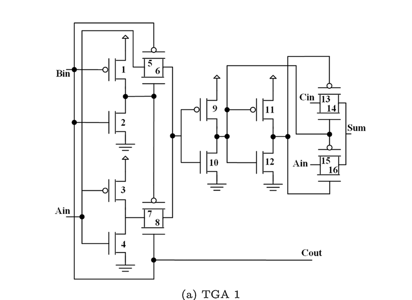
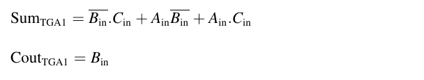
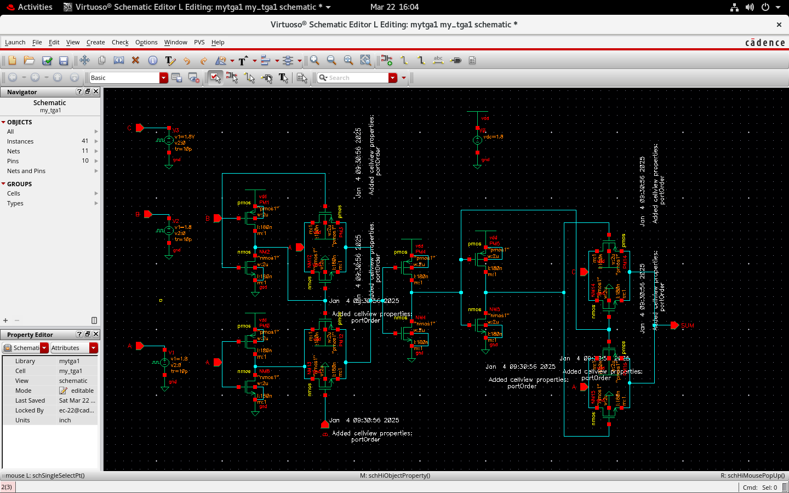
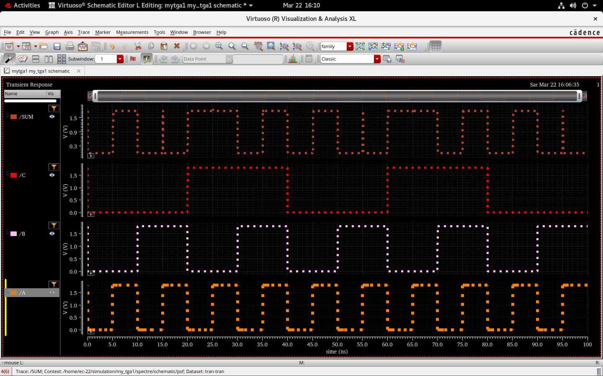
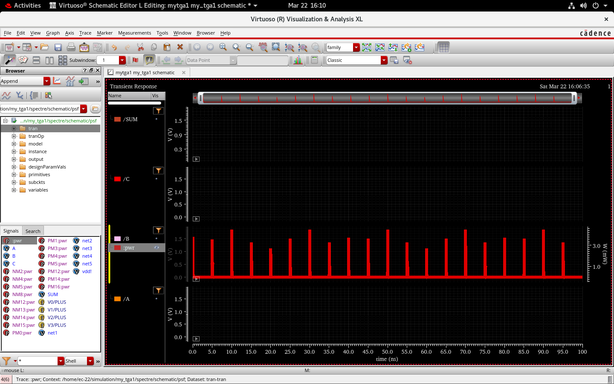
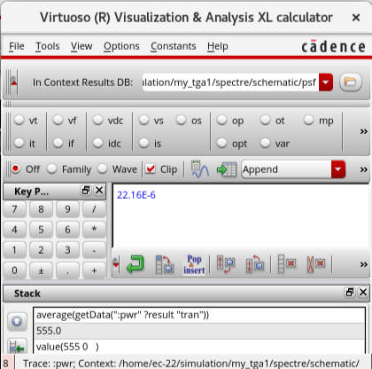
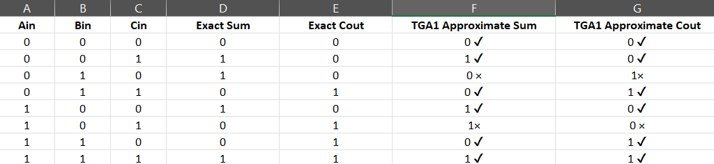

# Low-Power Approximate Adder Design and Simulation in Cadence Virtuoso (180nm Technology)

Designed and simulated a low-power approximate adder using Cadence Virtuoso at 180nm CMOS.

---

## 📌 Project Overview

This project focuses on the design and simulation of a **low-power approximate full adder** using **Cadence Virtuoso** with **180nm CMOS technology**, based on the journal paper:

**LAHAF: Low-power, area-efficient, and high-performance approximate full adder based on static CMOS**

The work targets power-constrained, error-resilient applications like **image processing**, **machine learning**, and **data mining**.

---

## 🎯 Motivation

In many real-world applications like image and video processing, **perfect accuracy is not essential**. Leveraging this tolerance, approximate computing helps reduce **power consumption and silicon area**. This project demonstrates how a simplified full adder circuit can contribute to such optimization.

---

## 🛠️ Design Flow

1. Studied the **LAHAF** journal and identified the TGA 1 approximate adder.
2. Implemented the TGA 1 adder schematic using **Cadence Virtuoso**.
3. Simulated using transient analysis to verify functional behavior.
4. Estimated **average power consumption**.
5. Compared outputs with an exact full adder to evaluate error distance.

---

## 🔧 Implementation Details

### 🧩 TGA 1 Circuit Description

- Built using **16 transistors** combining **Static CMOS logic** and **Transmission Gate Logic**.
- Major simplification: **Cout = Bin**
- Reduces transistor count and power consumption while being suitable for approximate computing.

### 📷 Circuit Diagram

### 🧮 TGA 1 Equations

---

## 🧪 Simulation Setup

- **Technology Node**: 180nm CMOS  
- **VDD**: 1.8V  
- **Input Pattern**: Pulse sources for A, B, and Cin to generate all 8 input combinations  
- **Simulation Type**: Transient Analysis  
- **Simulation Duration**: 100ns  
- **Tool Used**: Cadence Virtuoso ADE  

---

## 📈 Results and Analysis

### 🔸 TGA 1 Circuit Schematic  

### 🔸 Transient Simulation Waveform  

### 🔸 TGA 1 Power Graph  

### 🔸 TGA 1 Average Power  

---

## 🔍 Comparison Table

The table compares the **sum** and **carry-out** outputs of the **exact full adder** and the **TGA1** approximate full adder.  
- Mismatches = ✗  
- Correct matches = ✓  
- **Error Distance (ED)** = 2

---

## 🔭 Limitations & Future Work

- The current analysis is limited to schematic-level simulation; performing delay analysis could provide more accurate and realistic performance metrics.
- The approximate full adder design can be extended into an 8-bit Ripple Carry Adder to evaluate its impact at the system level in applications such as image processing. 
- Plan to use **Analog Mixed-Signal (AMS)** environment in Cadence:
  - Feed **binary pixel values** from two images as inputs.
  - Observe **voltage-level outputs**, convert them back into image format.
  - Evaluate visual quality under approximate computation.

---

## 📚 Reference

**LAHAF: Low-power, area-efficient, and high-performance approximate full adder based on static CMOS**  
*A. Khoshavi, S. Asgarinejad, S. K. Mohammadi, M. Fazeli*  
[📎 ScienceDirect Link](https://www.sciencedirect.com/science/article/pii/S2210537921000226)
## 👥 Team & Supervision

- **Project Guide**: Prof. [ANITHA JULIETTE], [ECE], [Loyola ICAM College of Enginering and Technology (LICET), Chennai] – [LinkedIn](https://www.linkedin.com/in/anitha-juliette-3a466163)
- **Team Members**:
  - [KARTHIKEYAN S] – [LinkedIn](https://www.linkedin.com/in/karthikeyan-s-ece)
  - [DHINAKARAN A] – [LinkedIn](https://www.linkedin.com/in/dhinakaran-a-206944256)
  - [BHARATHAN K] – [LinkedIn](https://www.linkedin.com/in/bharathan-k-5abb3b26a)
  - [SESHANTH] – [LinkedIn](https://www.linkedin.com/in/teammate3)
